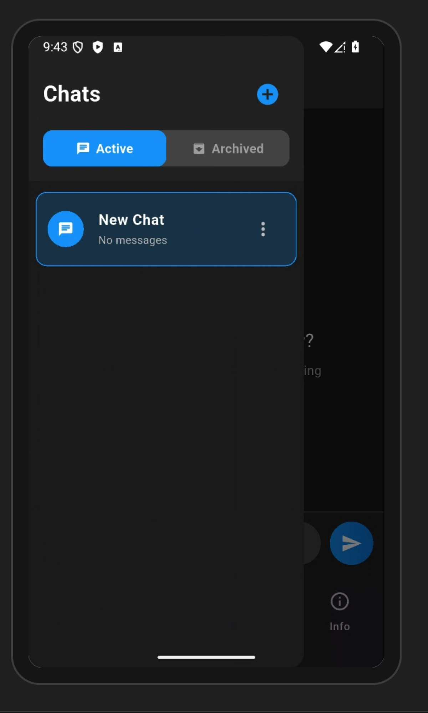
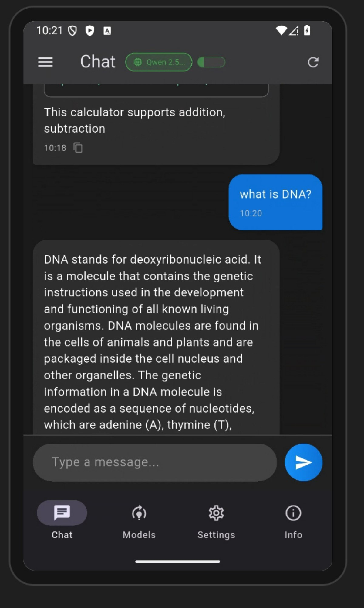
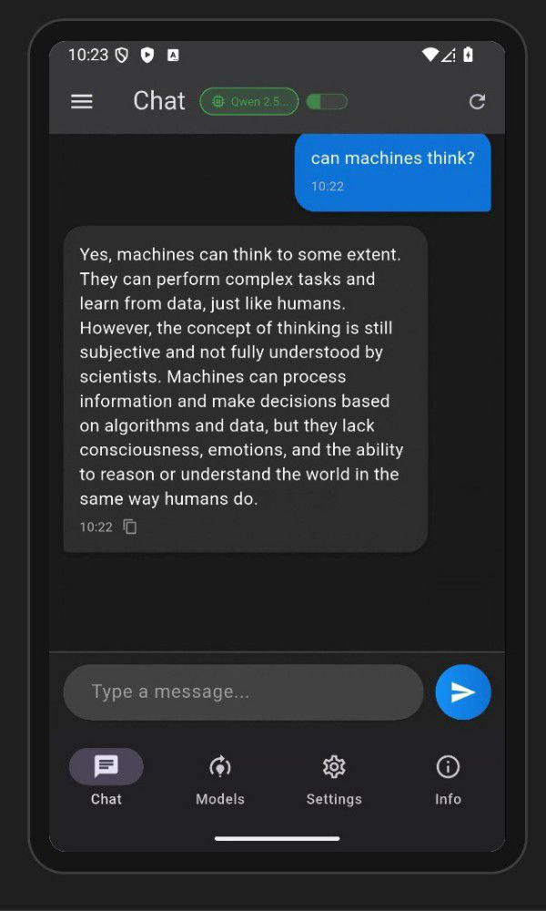

# Assistant_OC — Локальний AI-асистент на Android

> Flutter-застосунок для запуску малих мовних моделей (LLM) безпосередньо на пристрої Android, без інтернету та хмари.

---

## Про проект

**Assistant_OC** — це мобільний AI-чат, що працює повністю офлайн. Він використовує бібліотеку [llama.cpp](https://github.com/ggerganov/llama.cpp) через FFI-інтеграцію у Flutter, що дозволяє запускати квантизовані GGUF-моделі безпосередньо на процесорі Android-пристрою.


---

## Можливості

- **Повністю офлайн** — модель завантажується один раз і запускається локально
- **Підтримка кількох моделей** — Gemma 3n, Phi-3 Mini, Llama 3.2, Qwen 2.5
- **Збереження чатів** — локальна SQLite база даних
- **Потоковий вивід** — текст генерується та відображається в реальному часі
- **Налаштування параметрів** — розмір контексту, batch size, квантизація
- **Темна тема** — Material 3 дизайн

---

## Скриншоти

### Завантаження та вибір моделі

| Екран завантаження | Вибір моделі |
|---|---|
|  |  |

### Чати



### Приклади використання

| Написання коду | Очікування відповіді |
|---|---|
|  |  |

| Біологія | Філософія |
|---|---|
|  |  |

### Технічні налаштування


---

## Архітектура

```
lib/
├── main.dart                 # Точка входу + Provider setup
├── ffi/
│   ├── llama_bindings.dart   # Dart-прив'язки до llama.cpp
│   └── llama_types.dart      # FFI-типи та структури
├── models/
│   ├── chat_model.dart       # Моделі даних (Chat, Message)
│   └── llm_model.dart        # LlmModel + QuantizationType
├── services/
│   ├── llm_service.dart      # Завантаження / генерація через llama.cpp
│   ├── model_manager.dart    # Менеджер моделей + завантаження з HuggingFace
│   ├── chat_storage.dart     # SQLite сховище чатів
│   └── prompt_manager.dart   # Управління промптами
├── screens/
│   ├── chat_screen.dart      # Головний чат-екран
│   ├── models_screen.dart    # Вибір та керування моделями
│   ├── settings_screen.dart  # Налаштування параметрів
│   └── info_screen.dart      # Інформація про проект
└── widgets/
    ├── chat_bubble.dart       # Бульбашки чату з Markdown
    └── navigation_drawer.dart # Бічна навігація з чатами

android/app/src/main/cpp/
├── llama_bindings.cpp        # Нативний C++ шар (FFI-міст)
├── llama_bindings.h          # Заголовки C-API
├── dart_api_dl.c / .h        # Dart Native Port API
└── llama.cpp/                # Субмодуль llama.cpp (GGML-рушій)
```

### Стек рівнів

```
┌─────────────────────────────────────────┐
│          Flutter UI  (Dart)             │  Material 3 / Provider
├─────────────────────────────────────────┤
│         LlmService  (Dart)              │  Singleton + ChangeNotifier
├─────────────────────────────────────────┤
│       LlamaBindings  (Dart FFI)         │  dart:ffi — lookupFunction
├─────────────────────────────────────────┤
│   libllama_bindings.so  (C++/NDK)       │  JNI-незалежний нативний шар
├─────────────────────────────────────────┤
│       llama.cpp  (GGML Core)            │  Transformer inference engine
└─────────────────────────────────────────┘
```

---

## Технічний стек

| Компонент | Технологія | Призначення |
|---|---|---|
| UI-фреймворк | Flutter 3.8+ / Dart | Кросплатформений інтерфейс |
| Нативний рушій | llama.cpp (GGML) | Трансформерний інференс на CPU |
| FFI-міст | `dart:ffi` + Android NDK | Прямий виклик C++ з Dart |
| Async-міст | Dart Native Port API (`dart_api_dl`) | Передача токенів у реальному часі |
| Управління станом | Provider (`ChangeNotifier`) | Реактивний UI |
| Локальна БД | SQLite (`sqflite`) | Зберігання чатів |
| Налаштування | `shared_preferences` | Збереження параметрів |
| Завантаження моделей | HTTP + SHA-256 верифікація | Безпечне завантаження з HuggingFace |
| Рендеринг тексту | `flutter_markdown` | Markdown у повідомленнях |

---

## Нативний порт (FFI-міст)

### Принцип роботи

Застосунок не використовує JNI (Java Native Interface). Замість цього реалізовано **прямий FFI-виклик** з Dart у нативну C++-бібліотеку через `DynamicLibrary.open('libllama_bindings.so')`.

При старті бібліотека завантажується один раз у singleton `LlamaBindings._internal()`. Усі C-функції прив'язуються через `_lib.lookupFunction<NativeSignature, DartSignature>('symbol_name')` — це compile-time перевірка типів на кордоні Dart/C++.

### Ініціалізація Dart API DL

Щоб C++ потік міг надсилати дані назад у Dart без блокування UI, використовується **Dart Native Port API** (`dart_api_dl`). Це дозволяє нативному коду публікувати повідомлення безпосередньо в Dart Isolate через механізм портів:

```cpp
// C++: ініціалізація Dart API
extern "C" DART_EXPORT intptr_t InitDartApiDL(void* data) {
    return Dart_InitializeApiDL(data);
}

// Надсилання токена у Dart через NativePort
static void send_to_dart(Dart_Port port, const char* message, bool is_error) {
    if (port == 0) return;
    Dart_CObject obj;
    obj.type = Dart_CObject_kString;
    obj.value.as_string = const_cast<char*>(message);
    Dart_PostCObject_DL(port, &obj);
}
```

```dart
// Dart: реєстрація NativePort та ініціалізація
_initDartApiDLFn = _lib.lookupFunction<
  IntPtr Function(Pointer<Void>),
  int Function(Pointer<Void>)
>('InitDartApiDL');

final initResult = _initDartApiDLFn(NativeApi.initializeApiDLData);
if (initResult != 0) throw Exception('Failed to initialize Dart API DL');
```

### C-API (публічний інтерфейс бібліотеки)

```c
// Завантаження GGUF-моделі
int32_t llama_dart_load_model(const char* path, llama_dart_model_params* params);

// Створення контексту інференсу
llama_dart_context* llama_dart_create_context(int32_t model_id,
                                               llama_dart_context_params* params);
// Токенізація вхідного тексту
llama_dart_tokens* llama_dart_tokenize(llama_dart_context* ctx, const char* text);

// Синхронна генерація
char* llama_dart_generate(llama_dart_context* ctx,
                           llama_dart_tokens* tokens,
                           llama_dart_inference_params* params);
// Асинхронна генерація через NativePort
void llama_dart_generate_async(llama_dart_context* ctx,
                                llama_dart_tokens* tokens,
                                llama_dart_inference_params* params,
                                int64_t dart_port);
// Управління контекстом
void    llama_dart_cancel_generation(llama_dart_context* ctx);
bool    llama_dart_is_generating(llama_dart_context* ctx);
void    llama_dart_clear_kv_cache(llama_dart_context* ctx);
int32_t llama_dart_get_kv_cache_pos(llama_dart_context* ctx);

// Звільнення пам'яті
void llama_dart_free_context(llama_dart_context* ctx);
void llama_dart_free_model(int32_t model_id);
void llama_dart_free_tokens(llama_dart_tokens* tokens);
void llama_dart_free_string(char* str);
```

### FFI-типи (Dart `Struct`)

Усі C-структури дзеркально описані на стороні Dart за допомогою `dart:ffi Struct`. Анотації `@Int32()`, `@Float()`, `@Bool()` гарантують правильне вирівнювання пам'яті (ABI-сумісність):

```dart
/// Параметри завантаження моделі
final class LlamaDartModelParams extends Struct {
  @Int32() external int nGpuLayers;
  @Int32() external int quantizationType;  // 4 = Q4, 8 = Q8
  @Int32() external int seed;
  @Int32() external int nBatch;
}

/// Параметри контексту інференсу
final class LlamaDartContextParams extends Struct {
  @Int32() external int nCtx;     // Розмір контекстного вікна (токени)
  @Int32() external int nBatch;   // Розмір батчу обробки
  @Int32() external int nThreads; // Кількість CPU-потоків
}

/// Параметри семплювання (sampling)
final class LlamaDartInferenceParams extends Struct {
  @Int32() external int maxTokens;
  @Int32() external int contextLength;
  @Float()  external double temperature;
  @Float()  external double topP;
  @Float()  external double topK;
  @Float()  external double repeatPenalty;
  @Float()  external double frequencyPenalty;
  @Float()  external double presencePenalty;
  @Int32() external int timeoutMs;
  @Bool()  external bool clearKvCache;
}

/// Токенізований текст
final class LlamaDartTokens extends Struct {
  external Pointer<Int32> tokens;  // Масив int32 ID токенів
  @Int32() external int nTokens;
}
```

---

## Методи оптимізації

### 1. Chunked Batch Processing (посегментна обробка вхідних токенів)

Замість truncation (обрізання) довгих промптів реалізовано **chunked processing**: вхідні токени подаються у модель блоками розміром `n_batch`. Це дозволяє коректно обробляти промпти, що перевищують розмір батчу, без втрати інформації:

```cpp
// C++: посегментна обробка вхідного промпту
int processed = 0;
int current_pos = kv_pos;

while (processed < (int)input_tokens.size()) {
    if (g_cancel_flags[ctx->handle].load()) break;  // Перевірка скасування

    int chunk_size = std::min(n_batch, (int)input_tokens.size() - processed);

    llama_batch batch = llama_batch_init(chunk_size, 0, 1);
    for (int i = 0; i < chunk_size; i++) {
        // false = не обчислювати logits для проміжних токенів (економія пам'яті)
        llama_batch_add(batch, input_tokens[processed + i], current_pos + i, {0}, false);
    }
    // Logits обчислюються лише для останнього токена в батчі
    batch.logits[batch.n_tokens - 1] = true;

    if (llama_decode(llama_ctx, batch) != 0) {
        llama_batch_free(batch);
        break;
    }

    processed += chunk_size;
    current_pos += chunk_size;
    llama_batch_free(batch);
}
```

### 2. Інкрементальний KV-Cache

KV-cache (Key-Value Cache) — це таблиця проміжних результатів обчислень механізму уваги (attention) для вже оброблених токенів. Скидати її на кожному запиті надлишково. Реалізовано два режими:

- **Повне очищення** (`clearKvCache = true`) — для початку нового чату, гарантує відсутність "пам'яті" попереднього діалогу
- **Інкрементальний режим** (`clearKvCache = false`) — продовжує обчислення з поточної позиції, скорочує час обробки повторних запитів

```cpp
// C++: зберігаємо позицію KV-cache між запитами
static std::map<int64_t, int32_t> g_kv_cache_positions;

// Після завершення генерації — фіксуємо нову позицію
int new_pos = llama_kv_self_seq_pos_max(llama_ctx, 0);
{
    std::lock_guard<std::mutex> state_lock(g_mutex);
    g_kv_cache_positions[ctx->handle] = new_pos;
}
```

```dart
// Dart: попередження переповнення контексту та автоматичне очищення
final kvPos = _bindings!.getKvCachePosition(_currentContext!);
final totalNeeded = kvPos + inputTokens + maxTokens;
if (totalNeeded > _contextLength) {
  _bindings!.clearKvCache(_currentContext!);
}
// Візуалізація заповненості контексту у UI
double get contextUsage => _contextLength > 0 ? _usedTokens / _contextLength : 0;
```

### 3. Визначення оптимальної кількості потоків

При створенні контексту автоматично обирається кількість CPU-потоків відповідно до кількості ядер пристрою:

```dart
int getOptimalThreadCount() {
  final cpuCores = Platform.numberOfProcessors;
  if (cpuCores >= 8) return 4;   // Octa-core: 4 потоки
  if (cpuCores >= 6) return 3;   // Hexa-core: 3 потоки
  if (cpuCores >= 4) return 2;   // Quad-core: 2 потоки
  return 1;                       // Dual-core: 1 потік
}
```

Для батч-декодингу встановлюється `n_threads_batch = n_threads`, що повністю задіює виділені ядра під час обробки вхідних токенів. Навмисне обмеження до 4 потоків запобігає тепловому дроселюванню (thermal throttling) на мобільних SoC.

### 4. Sampling-параметри інференсу

Кожен запит до моделі передає набір параметрів семплювання, що визначають якість і різноманітність відповідей:

| Параметр | Значення | Опис |
|---|---|---|
| `temperature` | 0.5 | Масштабування logit-розподілу — нижче = детермінованіше |
| `topP` | 0.85 | Nucleus sampling: відбирає токени, що покривають 85% ймовірності |
| `topK` | 40 | Обмежує вибір до 40 токенів з найвищою ймовірністю |
| `repeatPenalty` | 1.2 | Ділить logit токена, якщо він вже зустрічався в контексті |
| `frequencyPenalty` | 0.1 | Штраф пропорційно частоті токена в поточному генерованому тексті |
| `presencePenalty` | 0.1 | Штраф за появу токена, що вже є в контексті (бінарний) |
| `timeoutMs` | 300 000 | Примусове завершення генерації після 5 хвилин |

### 5. Автоматичний захист від переповнення контексту

Перед кожним інференсом перевіряється запас у контекстному вікні. При критичному переповненні KV-cache очищується автоматично:

```cpp
// C++: двоступеневий захист від о
if (kv_pos + input_tokens_count + max_gen_tokens > n_ctx) {
    int max_input = n_ctx - max_gen_tokens - kv_pos - 64;  // 64-токенний захисний буфер

    if (max_input < 64) {
        // Критичне переповнення — очищення KV-cache
        LOGW("GENERATE: Context overflow, clearing KV-cache");
        llama_memory_t memory = llama_get_memory(llama_ctx);
        if (memory) llama_memory_clear(memory, true);
        kv_pos = 0;
        max_input = n_ctx - max_gen_tokens - 64;
    }

    if (input_tokens_count > max_input) {
        LOGW("GENERATE: Truncating input from %d to %d tokens",
             input_tokens_count, max_input);
        input_tokens_count = max_input;
    }
}
```

### 6. Паралелізм та захист від гонок даних (race conditions)

На нативному рівні використовуються два роздільні мʼютекси і атомарні прапори:

```cpp
static std::mutex g_mutex;             // Захист глобального стану (моделі, контексти)
static std::mutex g_generation_mutex;  // Захист процесу генерації (не блокує інші операції)

// Атомарні прапори для lock-free перевірки стану
static std::map<int64_t, std::atomic<bool>> g_cancel_flags;
static std::map<int64_t, std::atomic<bool>> g_generating_flags;
```

На Dart-стороні реалізовано власний механізм захисту від паралельних викликів:

```dart
// Очікування завершення попередньої генерації на C++ рівні
if (_bindings!.isGenerating(_currentContext!)) {
  for (int i = 0; i < 30 && _bindings!.isGenerating(_currentContext!); i++) {
    await Future.delayed(const Duration(milliseconds: 100));
  }
  if (_bindings!.isGenerating(_currentContext!)) {
    return 'Error: Generation already in progress';
  }
}
// Захист на Dart рівні (подвійний бар'єр)
if (_isGenerating) {
  for (int i = 0; i < 50 && _isGenerating; i++) {
    await Future.delayed(const Duration(milliseconds: 100));
  }
}
```

### 7. Guard Sets — захист від double-free

Звільнення нативної пам'яті через FFI небезпечне: повторний виклик `free()` на той самий покажчик призводить до UB (Undefined Behavior). Реалізовано Guard Sets — множини адрес вже звільнених об'єктів:

```dart
// Відстеження вже звільнених покажчиків
final Set<int> _freedTokens = {};
final Set<int> _freedContexts = {};

void freeTokenizedText(Pointer<LlamaDartTokens> tokens) {
  final addr = tokens.address;
  if (_freedTokens.contains(addr)) {
    debugPrint('WARNING: double-free prevented at $addr');
    return;  // Ігноруємо — об'єкт вже звільнено
  }
  _freedTokens.add(addr);
  _freeTokensFn(tokens);
}
```

При завантаженні нової моделі Guard Sets скидаються: `_bindings!.resetFreedGuards()`, оскільки адреси можуть бути переданими заново.

---

## Потокова генерація (Stream Architecture)

### Пайплайн від запиту до UI

```
Dart UI
  │ sendMessage()
  ▼
LlmService.generateResponseStream()
  │ StreamController<String>.broadcast()
  ▼
_generateStreamAsync()  [async Dart function]
  │ await generateResponse()  ──► FFI call ──► C++ llama_decode() loop
  │                                             (окремий std::thread)
  ▼
_cleanResponse()  [видалення стоп-послідовностей, нормалізація пробілів]
  │ chunkSize = 3 символи  ──► throttle: кожні 5 чанків або кожні ~16 мс
  ▼
StreamController.add(chunk)
  ▼
chat_screen._startListeningToStream()
  │ throttle UI update: 50 мс
  ▼
setState() → перемальовування ChatBubble
```

### Throttle оновлень UI

Потокове оновлення інтерфейсу обмежене по частоті — не частіше ніж раз на 50 мс. Це запобігає фреймрейт-дропам на слабких пристроях при швидкій генерації:

```dart
static const _uiUpdateInterval = Duration(milliseconds: 50);

_streamSubscription = stream.listen(
  (token) {
    _currentGeneratedText += token;
    final now = DateTime.now();
    if (now.difference(_lastUIUpdate) >= _uiUpdateInterval) {
      _lastUIUpdate = now;
      _safeSetState(() {});
      _scrollToBottom();
    }
  },
  onDone: () async => _onGenerationComplete(llmService),
  onError: (e) => _safeSetState(() => _isGenerating = false),
);
```

Стрімінг на рівні сервісу також throttle-ується: чанки по 3 символи надсилаються в контролер кожні 5 ітерацій або кожні 16 мс (один кадр при 60 fps).

### Стоп-послідовності

Генерація автоматично зупиняється при виявленні спеціальних маркерів формату чату. Один набір стоп-послідовностей охоплює всі підтримувані моделі:

```dart
static const List<String> _stopSequences = [
  'User:', '\nUser:', 'Human:', '\nHuman:',
  'Assistant:', '\nAssistant:',
  '<|im_end|>', '<|im_start|>',        // ChatML формат (Qwen, Phi)
  '<end_of_turn>', '<start_of_turn>',  // Gemma формат
  '<|eot_id|>',                        // Llama 3.2 формат
  '<|end|>', '</s>', '<|assistant|>', '<|user|>',
];
```

Перевірка відбувається і на C++ (під час декодингу), і на Dart (під час стрімінгу) — двошарова фільтрація виключає артефакти у вихідному тексті.

### Пост-обробка відповіді

```dart
String _cleanResponse(String response) {
  String cleaned = response;
  for (final stop in _stopSequences) {
    if (cleaned.contains(stop)) {
      cleaned = cleaned.split(stop).first;  // Зрізаємо все після стоп-маркера
    }
  }
  cleaned = cleaned.trim();
  cleaned = cleaned.replaceAll(RegExp(r'\n{3,}'), '\n\n');  // Не більше двох порожніх рядків
  cleaned = cleaned.replaceAll(RegExp(r' {2,}'), ' ');       // Нормалізація пробілів
  return cleaned;
}
```

---

## Квантизація та формат моделей

### GGUF-формат

Усі моделі використовують формат **GGUF** (GGML Unified Format) — бінарний контейнер з вбудованими метаданими (токенайзер, гіперпараметри, тип архітектури) та квантизованими тензорами ваг. Не потребує окремих конфігураційних файлів.

### Схеми квантизації

| Схема | Біт/вага | Особливість | Компроміс |
|---|---|---|---|
| `Q4_K_M` | ~4.5 | K-квантизація: важливі шари у 6-bit, решта у 4-bit | Найкращий баланс якості/розміру |
| `Q4` | 4.0 | Рівномірна 4-бітна квантизація по всій мережі | Менший розмір, нижча точність |
| `Q8` | 8.0 | 8-бітна квантизація — майже без втрат | Максимальна якість, великий розмір |

**Q4_K_M** обрано як основну схему: **K-квантизація** групує ваги у блоки та зберігає один scale-factor на блок, що значно зменшує похибку округлення порівняно з поелементною Q4. Суфікс **_M** (Medium) означає, що шари з найбільшим впливом (embedding, output projection) зберігаються в 6-bit замість 4-bit.

---

## Ключові частини коду

### Ініціалізація застосунку (`main.dart`)

Застосунок використовує `Provider` для управління станом. Усі сервіси ініціалізуються до запуску UI:

```dart
void main() async {
  WidgetsFlutterBinding.ensureInitialized();

  final llmService = LlmService();
  await llmService.init();

  final chatStorage = ChatStorage();
  await chatStorage.init();

  runApp(
    MultiProvider(
      providers: [
        ChangeNotifierProvider.value(value: llmService),
        ChangeNotifierProvider.value(value: chatStorage),
        ChangeNotifierProvider(
          create: (_) => ModelManager(llmService: llmService),
        ),
      ],
      child: const MyApp(),
    ),
  );
}
```

### LLM-сервіс (`llm_service.dart`)

Singleton-сервіс для завантаження моделі та потокової генерації тексту через llama.cpp FFI:

```dart
class LlmService extends ChangeNotifier {
  static final LlmService _instance = LlmService._internal();
  factory LlmService() => _instance;

  LlamaBindings? _bindings;
  int? _currentModelId;
  Pointer<LlamaDartContext>? _currentContext;
  int _contextLength = 1024;
  int _batchSize = 512;
  bool _isGenerating = false;
  bool _shouldStop = false;
  bool _useIncrementalKvCache = false;
  final Map<String, StreamController<String>> _generationControllers = {};

  bool get isModelLoaded =>
      _currentModelId != null &&
      _currentContext != null &&
      _currentContext != nullptr;

  double get contextUsage =>
      _contextLength > 0 ? _usedTokens / _contextLength : 0;

  Future<void> init() async {
    _bindings = LlamaBindings();
    final prefs = await SharedPreferences.getInstance();
    _contextLength = prefs.getInt('context_length') ?? 1024;
    _batchSize = prefs.getInt('batch_size') ?? 512;
    _isInitialized = true;
  }
}
```

### Менеджер моделей (`model_manager.dart`)

Завантаження GGUF-моделей з HuggingFace з верифікацією SHA-256:

```dart
LlmModel(
  id: 'gemma-3n-E2B-it-Q4_K_M',
  name: 'Gemma 3n E2B It (4-bit)',
  description: 'A 3rd generation, lightweight model from Google.',
  url: 'https://huggingface.co/unsloth/gemma-3n-E2B-it-GGUF/resolve/main/'
      'gemma-3n-E2B-it-Q4_K_M.gguf?download=true',
  size: 3030000000,
  quantization: QuantizationType.bit4,
),
```

Потокова верифікація цілісності файлу без завантаження усього файлу в RAM:

```dart
Future<bool> verifyModelChecksum(String modelId) async {
  final output = AccumulatorSink<Digest>();
  final input = sha256.startChunkedConversion(output);

  await for (final chunk in modelFile.openRead()) {
    input.add(chunk);  // Читаємо файл чанками — O(1) по пам'яті
  }
  input.close();

  final currentChecksum = output.events.single.toString();
  return storedChecksum == currentChecksum;
}
```

### Сховище чатів (`chat_storage.dart`)

SQLite-база зі схемою, що підтримує каскадне видалення та зовнішні ключі:

```dart
await db.execute(
  'CREATE TABLE chats('
  'id INTEGER PRIMARY KEY AUTOINCREMENT, '
  'title TEXT, created_at TEXT, updated_at TEXT, is_archived INTEGER'
  ')',
);
await db.execute(
  'CREATE TABLE messages('
  'id INTEGER PRIMARY KEY AUTOINCREMENT, '
  'chat_id INTEGER, content TEXT, is_user INTEGER, timestamp TEXT, '
  'FOREIGN KEY (chat_id) REFERENCES chats (id) ON DELETE CASCADE'
  ')',
);
// Вмикаємо підтримку зовнішніх ключів (за замовчуванням вимкнена у SQLite)
await db.execute('PRAGMA foreign_keys = ON');
```

---

## Підтримувані моделі

| Модель | Розробник | Розмір файлу | Квантизація | Параметри |
|---|---|---|---|---|
| Gemma 3n E2B It | Google | ~2.8 GB | Q4_K_M | ~2B effective |
| Phi-3 Mini Instruct | Microsoft | ~2.2 GB | Q4 | 3.8B |
| Llama 3.2 1B Instruct | Meta | ~770 MB | Q4_K_M | 1B |
| Qwen 2.5 1.5B Instruct | Alibaba | ~940 MB | Q4_K_M | 1.5B |

---

## Залежності

```yaml
dependencies:
  flutter:
    sdk: flutter
  provider: ^6.1.2           # Управління станом (ChangeNotifier)
  path_provider: ^2.1.4      # Доступ до локального сховища
  sqflite: ^2.3.3+1          # SQLite база даних
  http: ^1.2.2               # HTTP-запити (завантаження моделей)
  crypto: ^3.0.3             # SHA-256 верифікація цілісності моделей
  shared_preferences: ^2.3.2 # Персистентне зберігання налаштувань
  ffi: ^2.1.2                # dart:ffi низькорівнева FFI-інтеграція
  path: ^1.9.0               # Керування файловими шляхами
  flutter_markdown: ^0.7.3+1 # Рендеринг Markdown у чаті
  animated_text_kit: ^4.2.2  # Анімація завантаження
```

---

## Збірка

### Нативні бібліотеки

`llama.cpp` компілюється через Android NDK за допомогою CMake. Підтримуються ABI: `arm64-v8a`, `armeabi-v7a`, `x86_64`.

```bash
# Зібрати нативні бібліотеки llama.cpp для всіх ABI
bash scripts/build_android_libs.sh
```

Ключові прапори компіляції для максимальної продуктивності на ARM:

```cmake
target_compile_options(llama_bindings PRIVATE
    -O3 -DNDEBUG              # Агресивна оптимізація, без debug-коду
    -march=armv8-a+fp+simd    # NEON SIMD для ARM64 (векторні операції)
    -ffast-math               # Дозволяє нестрогу FP-арифметику (швидші операції)
)
```

### Flutter APK

```bash
flutter build apk --release
```

### Вимоги

- Flutter SDK `^3.8.1`
- Android NDK r26+ (для компіляції llama.cpp)
- Android 7.0+ (API 24+), рекомендовано ARM64 пристрій з 4+ ГБ RAM

---

## Ліцензія

MIT License
